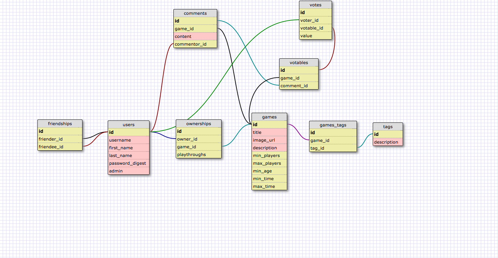

# the-dream-boys
Client Project for [Bo](https://github.com/boguth), [Nick](https://github.com/nsiefken), [Pete](https://github.com/pmacaluso3), and [Michael](https://github.com/michaelkunc)
- A site to help track users’ libraries of board games.

## User Stories
1. As a user, I want to be able to create an account with a gamertag.
- As a user, I want to be able to login.
- As a user, I want to be able to logout.
- As a user, I want to see a list of my games.
- As a user, I want to see a list of my friends' games (first degree) by looking at their profile.
- As a user, I want to be able to add non-existent games to my list (through a form), which will then get added to the global list of games if it doesn't exist.
- As a user, I want to be able to see a list of my friends.
- As a user, I want to be able to tag my board game with mechanics from a given list of mechanics.
- As a user, I want to be able to find board games by mechanics (tags) (MVP is public/global)
- As a user, I want to be able to add comments to a board game.
- As a user, I want to upvote or dowvote games (1 vote per person).
- As a user, I want to upvote or downvote comments.
- As a user, I want to see a list of all the games in the database with or without being logged in.
- As a user, I want to be able to search for people.
- As a user, I want to be able to add people as my friend, without their permission (reflexively).
- As a user, I want to be able to remove a friendship, without their permission (reflexively).
- As a game, I want to be represented by a picture when I am a part of a list.
- As a game, I want my upvotes or downvotes to be global.
- As a game, I have a profile page.
- As a game, I want to be able to be added to people's personal libraries if they don't have me.
- As a comment, I want my upvotes or downvotes to be global.

###Stretch:
- Play history for games and users
- As a user, I want to be able to see a list of games shared by my group of friends. >-- game night feature ** Game night feature
- Smart selector - search for multiple game criteria within friend network ** Game night feature
- Admin can edit games and tags.

##Team Norms
1. Strong/weak pairs when appropriate.
2. Product is priority.
3. No floundering.
4. Vertical slices only (that includes test).
5. Not finished until tested.
6. High five upon vertical completion.
7. Good git workflow, small discreet chunks.
8. Pull all the time.
9. Attach screenshots to view commits.
10. No lunch work.
11. Five to six break.
12. Day ends at 20:30.
13. Naming conventions are sacred.

##Requirements
- Rails 4.2.1 or higher.
- Postgres server.

To add:

* System dependencies

* Configuration

* Database creation

* Database initialization

* How to run the test suite

* Services (job queues, cache servers, search engines, etc.)

* Deployment instructions

##Schema

##Resources
[Example of good readme](https://github.com/devdame/DBC-final-project)

##CI and coverage tests
View the log of CI reports [here](https://travis-ci.org/chi-dragonflies-2015/the-dream-boys).
The coveralls URL near the bottom of the report leads to coverage reports.

##View Images
